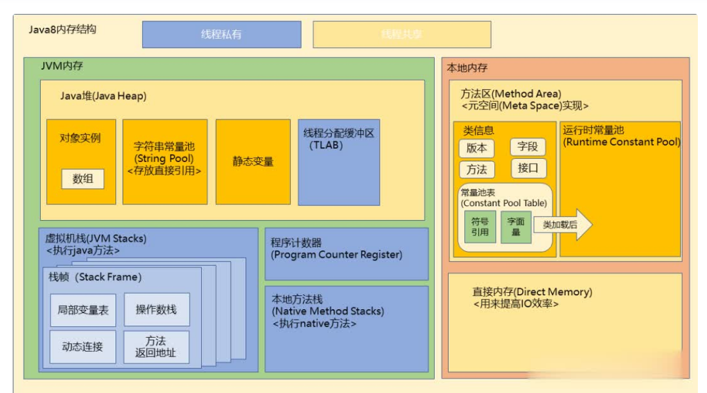

# Java Virtual Machine

识别运行编译好的.class文件，JVM针对不同的操作系统有不同的解释器，使.class文件能在不同的操作系统上运行，这就是java的一次编译，到处运行。
**生命周期** Java程序开始执行后，直至程序结束
**两种线程** 守护线程和普通线程，守护线程为jvm自己使用的线程，例如GC就是一种。

其内存结构主要可分为：方法区、堆、Java栈、本地方法栈、PC寄存器五块区域

## 内存结构



### 方法区

JDK1.7及以前Hotspot使用永久代的概念实现方法区，所以方法区又称永久代

各个线程共享的内存区域，用于存放已被虚拟机加载类的**静态变量**、**常量**、**类的元信息**（类定义全名、类访问修饰符、方法名、访问权限、返回值、加载器等）

**常量池的好处：**避免频繁的创建和销毁对象而影响系统性能，在编译阶段就将所有的字符串文字放到一个常量池，常量池中所有相同的字符串被合并，只占用一个空间，节省内存空间

所有线程共用一个方法区，所以访问方法区的线程必须是确保安全，同一时间只能有一个线程访问方法区，也称作为永久代

- 控制参数
  - -XX:PermSize 设置最小空间
  - -XX:MaxPermSize 设置最大空间
- 异常
  - 当方法区无法满足内存分配需求时，抛出OOM

由于永久代经常OOM，PermGen类及方法的信息难以确定大小，不好指定初始化大小， 太小永久代溢出，太大老年代溢出。

 jdk1.8之后调整为元空间，使用本地内存，不在虚拟机中，默认情况下元空间大小仅受本地内存大小限制，也可手动指定。

- -XX:MetaspaceSize初始空间大小
- -XX:MaxMetaspaceSize最大空间大小
永久代移除后，使用元空间，内存溢出的错误就不存在了，但是依然存在自定义的类加载器泄漏的问题

### 堆

GC的主要场所，当Java创建一个类的实例对象和数组时，都会在堆中分配内存；在结构上可以分为新生代和老年代，新生代又可分为Eden和 两个Survivor空间，比
例为8：1：1；由于新生代对象98%都是朝生夕死的，所以不需要按照1：1进行划分；两个survivor来回进行复制，避免内存碎片化带来的空间和性能损失。
JDK 1.8之后，划分字符串实例到堆
- 控制参数
  - -Xms  设置堆的最小空间大小。
  - -Xmx  设置堆的最大空间大小。
  - -XX:NewSize 设置新生代最小空间大小。
  - -XX:MaxNewSize 设置新生代最大空间大小。
  - -XX：SurvivorRatio， Eden区域比例
  - -XX：NewRatio， 新生代与老年代比例
- 异常
如果堆中没有内存完成实例分配，并且堆也无法再扩展时，排除OutOfMemory，可使用**-xmx 4096m**调整堆的总大小
#### 3.1 常量池
字符串常量池、类的静态变量从jdk1.8之后有方法区转移到堆空间
### 栈
保存基础类型的变量数据和对象的引用数据，每个线程包含一个栈区，其内部数据是私有的，其他栈区无法访问，

栈中包含了多个栈帧，每个栈帧对应每个方法的每次调用，

栈区分为三个部分：局部变量区（存放方法内基本类型数据和变量对象指针）， 操作数栈区（存放方法执行过程中产生的中间结果）， 运行环境区（动态连接、正确的方法返回相关信息、异常捕捉）

- 控制参数
  - -Xss控制每个线程栈的大小

| Java堆                                                 | Java栈                                                       |
| ------------------------------------------------------ | ------------------------------------------------------------ |
| 一个堆区，被所有线程共享                               | 每个线程包含一个栈区                                         |
| 动态分配内存大小，生存周期也不需事先定义，存取数据较慢 | 存取速度较快，仅次于寄存器，栈中数据大小和生存期须事先确定，缺乏灵活性 |
|                                                        |                                                              |
|                                                        |                                                              |

- 异常

如果请求的栈深度大于虚拟机允许的最大深度，则会抛出StackOverFlowError， 可用**-xss**调整JVM栈的大小; 

如果栈可以动态扩展，但是扩展时无法申请到足够的内存，则抛出OutOfMemory；

### 本地方法栈

与Java栈类似，用于存储本地方法的局部变量表，为虚拟机是使用到的native方法服务

### PC计数器

当前线程所执行的字节码文件的行号指示器。唯一一个没有规定任何OOM的区域。

## GC

Java程序内存主要分为两部分，堆和非堆。GC回收的主要对象是堆

```
堆内存由垃圾回收器的自动内存管理系统回收
堆内存分为两块：老年代和新生代
老年代主要用于存储生命周期较长的存活对象
新生分为Eden和两个Survivor区，比例为8：1：1，
Eden用于存放新生的对象，Survivor存放每次垃圾回收后存货的对象
```

### 调优目标

- **相应速度（Responsiveness）**，系统或者程序对一个请求的相应有多迅速，例如用户查询订单，对响应速度有很高的要求，较大的停顿时间是不可接受的，调优的重点是如何在短时间内响应
- **吞吐量(Throughput)** 吞吐量关注在一个特定时间段内应用系统的最大工作量，它指的是系统在单位时间处理请求的数量，例如每小时批处理系统能完成的任务数量，在吞吐量方面优化的系统，较长的GC停顿时间也是可以接受的，因为高吞吐量应用更关心的是如何尽可能快地完成整个任务，不考虑快速响应用户请求

### 事件分类

+ **Young GC**, 新生代内存的垃圾回收，当虚拟机无法为新对象在新生代分配内存空间时触发young gc，young gc触发时，会造成全线停顿，暂停所有的应用线程，但是停顿时间相对老年代gc造成的停顿，可忽略不计
+ **Old GC**，只清理老年代空间的GC事件，只有CMS的并发收集是这个模式 
+ **Full GC**，清理整个堆的GC事件，包括新生代、老年代、元空间等
+ **Mixed GC**，清理整个新生代以及部分老年代的GC，只有G1有这个模式


### 判定可回收对象

常用两种判定对象存活算法

#### 引用计数法
给对象添加一个引用计数器，当有一次引用时，计数器加一；当引用失效时，计数器减一；任何计数器为零的对象即为不可能再被使用的对象
**缺点**

1. 计数器值的增减频繁处理
2. 计数器需要占用很多位
3. 循环引用无法回收
#### 可达性算法：


### 垃圾回收算法
#### 标记 - 清除

分为标记阶段和清除阶段，标记阶段通过可达性算法，从根节点出发，标记处所有根节点可达的对象，未标记就是未被引用的垃圾对象；清除阶段，清楚所有未被标记的对象，

缺点：

- 效率问题，标记和清除两个过程效率都不太高
- 空间问题，标记清楚后会产生大量的不连续的内存碎片，空间碎片太多会导致以后在程序允许的时候，需要分配较大的对象，由于空间不足，会提前触发GC

#### 标记 - 整理

与标记清除类似，但是标记完成后不立马进行清除操作，而是是存活对象向一端移动，然后清除掉边界以外的内存

- 优点
  - 相对标记清除，解决了内存空间碎片的问题

- 缺点：
  - 效率问题，标记和清除两个过程效率都不高

#### 标记 - 复制

将内存按容量分配为大小相等的两块，每次只使用其中的一块，当这块使用完了，将存活的对象复制到另外一块上，然后再把已经使用过的内存空间一次清理掉，这样使得每次都是对整个半区进行内存回收，内存分配时也就不用考虑内存碎片等复杂情况。

- 优点
  - 效率高，没有内存空间碎片

- 缺点
  - 浪费一半的空间
  - 在对象存活率较高时，就要进行很多复制操作，导致效率降低

#### 分代收集算法

当前商业虚拟机都采用分代回收的算法，它根据对象存活周期的不同将内存划分为几块，一般是新生代和老年代，然后根据各个年代的特点采用适当的收集算法，在新生代中，由于有大量的对象死去，只有少量存活，所以使用复制算法，而老年代因为对象存活率高，没有额外空间对它进行分配担保，就必须使用“标记清理”或者“标记整理”算法来进行回收。CMS使用

### 垃圾回收器

#### CMS Concurrent Mark Sweep
利用CPU多核资源，并发标记和清除垃圾对象
处理流程：
1、Stop-the-world, 暂停所有的线程，找到所有垃圾回收的根结点对象
2、并发标记根节点对象关联的下溯对象
3、预清理，减少下一步重新标记的工作量
4、Stop-the-world，重新标记，这段时间新增的垃圾对象
4、并发清除回收

缺点：
- 标记-清除算法带来的垃圾碎片
- concurrent mode failure，ygc清除回收时，将年轻代对象转入老年代，此时系统也在运行，老年代空间不足导致OOM。XX:+UseCMSInitiatingOccupancyOnly -XX:CMSInitiatingOccupancyFraction=60：是指设定CMS在对内存占用率达到60%的时候开始GC。


lazada app run command
```
/opt/taobao/java/bin/java -server 
-javaagent:/home/admin/appstack-iac-vol/rasp/rasp-agent.jar=1,/home/admin/appstack-iac-vol/rasp/jam-framework 
-Xms4g 初始堆大小
-Xmx4g 最大堆大小
-Xmn2g 年轻代大小
-XX:MetaspaceSize=512m 
-XX:MaxMetaspaceSize=512m 
-XX:MaxDirectMemorySize=1g 
-XX:SurvivorRatio=10 年轻代中Eden区与Survivor区的大小比值。如果设置为4，那么两个Survivor区与一个Eden区的比值为2:4，一个Survivor区占整个年轻代的1/6。
-XX:+UseConcMarkSweepGC 
-XX:CMSMaxAbortablePrecleanTime=5000 
-XX:+CMSClassUnloadingEnabled 
-XX:CMSInitiatingOccupancyFraction=80 
-XX:+UseCMSInitiatingOccupancyOnly 
-XX:+ExplicitGCInvokesConcurrent 
-Dsun.rmi.dgc.server.gcInterval=2592000000 
-Dsun.rmi.dgc.client.gcInterval=2592000000 
-Xloggc:/home/admin/logs/gc.log 
-XX:+PrintGCDetails 
-XX:+PrintGCDateStamps 
-XX:+HeapDumpOnOutOfMemoryError 
-XX:HeapDumpPath=/home/admin/logs/java.hprof 
-Djava.awt.headless=true 
-Dsun.net.client.defaultConnectTimeout=10000 
-Dsun.net.client.defaultReadTimeout=30000 
-DJM.LOG.PATH=/home/admin/logs 
-DJM.SNAPSHOT.PATH=/home/admin/snapshots 
-Dfile.encoding=UTF-8 
-Dhsf.publish.delayed=true 
-Dproject.name=lazmall-customer-advocate-s 
-Dpandora.boot.wait=true 
-Dlog4j.defaultInitOverride=true 
-Dserver.port=7001 
-Dmanagement.port=7002 
-Dmanagement.server.port=7002 
-agentlib:jdwp=transport=dt_socket,address=8000,server=y,suspend=n 
-Dpandora.location=/home/admin/lazmall-customer-advocate-s/target/taobao-hsf.sar 
-Dmtop.not.check.project.name=true 
-classpath /home/admin/lazmall-customer-advocate-s/target/lazmall-customer-advocate-s 
-Dapp.location=/home/admin/lazmall-customer-advocate-s/target/lazmall-customer-advocate-s 
-Djava.endorsed.dirs= 
-Djava.io.tmpdir=/home/admin/lazmall-customer-advocate-s/.default/temp com.taobao.pandora.boot.loader.SarLauncher
```


G1
可预测的回收时间的垃圾回收器

## 性能调优工具

- jstack，得到程序运行栈的线程信息
- jmap，堆内存使用情况，结合jhat使用
- jstat，JVM统计监测工具


## 类加载

### Step-1装载
- 通过类的全限定名（包名和类名）来获取定义此类的二进制class文件，
- 然后将字节码文件代表的静态存储结构转化为方法区的运行时数据结构，
- 最后在内存中生成一个代表这个类的java.lang.Class对象，作为方法区这些数据的访问入口

### Step-2验证
- 验证字节流是否符合虚拟机的规范，保证输入的字节流能被虚拟机正确的解析并存储与方法区之内
- 元数据验证，对类的各数据类型进行语法校验，保证不存在不符合Java规范的元数据信息
- 字节码验证，对控制流和数据流进行分析，对类的方法体进行分析，保证运行时不会做出危害虚拟机的操作
- 符号引用校验，虚拟机将符号引用转化为直接引用，主要是对类自身以外的信息（常量池中的各种符号引用）进行匹配性的校验

### Step-3准备
- 为类变量分配内存并设置初始值，但是分配内存的变量仅包括类变量（static），在方法区进行
- 对基本数据类型来说，对于类变量（static）和全局变量，如果不显式地对其赋值而直接使用，则系统会为其赋予默认的零值，而对于局部变量来说，在使用前必须显式地为其赋值，否则编译时不通过
- 对于同时被static和final修饰的常量，必须在声明的时候就为其显式地赋值，否则编译时不通过；而只被final修饰的常量则既可以在声明时显式地为其赋值，也可以在类初始化时显式地为其赋值，总之，在使用前必须为其显式地赋值，系统不会为其赋予默认零值。
- 对于引用数据类型reference来说，如数组引用、对象引用等，如果没有对其进行显式地赋值而直接使用，系统都会为其赋予默认的零值，即null。
- 如果在数组初始化时没有对数组中的各元素赋值，那么其中的元素将根据对应的数据类型而被赋予默认的零值。

### Step-4解析
解析阶段是虚拟机将常量池中的符号引用转化为直接引用的过程，针对类或接口、字段、类方法、接口方法、方法类型、方法句柄和调用点限定符 7 类引用进行解析。

**符号引用：** 一组描述引用的符号，可以是任何形式的字面量，只要能无歧义地定位到目标即可

**直接引用：**可以是直接指向目标的指针、相对偏移量或者是一个能定位到目标的句柄，和虚拟机的内存分布有关，同一个符号引用在不同的虚拟机上翻译出来的直接引用不会相同，如果有了直接引用，那么引用的目标必然存在于内存之中。

### Step-5初始化
- 初始化类变量，包括两种方式，声明时指定初始值和使用静态块代码设定初始值

### 类加载器

类加载器（class loader）用来加载 Java 类到 Java 虚拟机中。一般来说，Java 虚拟机使用 Java 类的方式如下：Java 源程序（.java 文件）在经过 Java 编译器编译之后就被转换成 Java 字节代码（.class 文件）。类加载器负责读取 Java 字节代码，并转换成 `java.lang.Class`类的一个实例。

**双亲委派模型**

类加载器在尝试自己去查找某个类的字节代码并定义它时，会先代理给其父类加载器，由父类加载器先去尝试加载这个类，依次类推,因此所有的类加载请求都会委派给顶层的启动类加载器，只有父加载器无法完成加载请求时，子加载器才会尝试完成加载请求


## 基础

- JDK -  Java Development Kit，Java开发工具包，包含了JVM、JRE、类库源码压缩包、编译java源码的编译器javac等等程序员开发时用到的工具软件
- JRE -  Java Runtime Environment， Java运行时环境，包含解释class文件需要用到的类库lib以及JVM
- JVM - Java Virtual Machine，Java虚拟机，它是Java跨平台的核心部分，所有的Java文件编译为的.class文件，出于java编译器与os之间，都是通过虚拟机在不同的操作系统上执行。

### OOP

- 抽象：将一类对象的共同特征总结出来构造类的过程
- 继承：子类从父类获取一系列属性与方法的过程
- 封装：将数据和操作数据的方法绑定起来，形成完全自治、封闭的对象，隐藏一切可以隐藏的东西，只向外界提供最简单的编程接口
- 多态：不同子类型的对象对同一消息做出不同的响应

**重载与重写**

重载：重载发生在一个类中，同名的方法如果有不同的参数，包括不同的参数类型和个数，称之为重载

重写：发生在子类与父类之间，重写要求子类重写的方法与父类有相同的放回类型

**transient**

序列化对象时，transient修饰的对象不会写入到磁盘中持久化

**泛型**

 把明确类型的工作推迟到创建对象或者调用方法的时候进行

## 反射

Java特征之一，允许Java程序在运行期间操作类以及内部的属性，JVM在运行时动态加载类或者调用方法以及访问属性。

- 缺点
  - 由于反射会额外消耗一定的系统资源，因此如果不需要动态地创建一个对象，那么就不需要用反射。

  - 另外，反射调用方法时可以忽略权限检查，因此可能会破坏封装性而导致安全问题。

todolist：元注解、Redis持久化、kbs较高下的架构/分布式高并发架构、concurrent包、线程同步CountDownLatch


## 引用

- 强引用：New出来的对象, eg: Object o = new Object(), 被垃圾回收算法标记上则进行回收
- 弱引用：GC的时候，不管内存空间足不足都会回收这个对象, Thread.Threadloca.ThreadlocalMap
- 软引用：内存不足的时候回收，一般用来实现内存敏感的缓存，比如图片缓存
- 虚引用：提供了一种确保对象被`finalize`以后来做某些事情的机制

