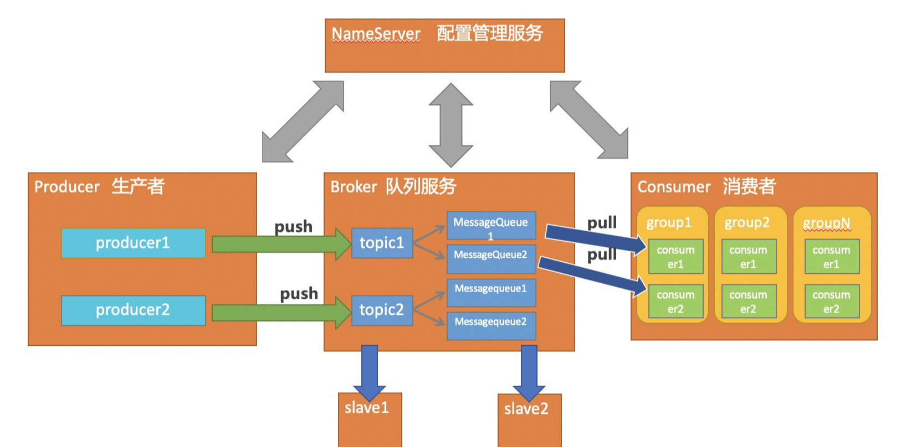

## 组件

**NameServer**
注册中心，管理路由信息和Broker
- 向其他组件提供路由信息暴露服务
- 其他组件定期向NS上报心跳状态，若超时不上报，则认为机器故障，进行移除

**消息生产者**
负责消息的生产和发送，定期从NameSever拉取Broker的路由信息，然后发送消息数据

**消息消费者**
，broker， NameSpace

**Broker**
负责消息的接收和存储，从生产者接收消息，处理消费者的请求
消息的持久化和在服务端的过滤

## 消费模型
**推模型**
当消息产出时，主动向消费者进行推送，不管下游能否承载，当QPS较大时，会给下游带来较大的风险

**拉模型**
消费者定期请求Broker，是否有新的消息数据产生。定期请求比较消耗Broker资源

**消费模式**
- 广播，订阅某Topic的消费组，都会处理每一条消息
- 集群，一条消息只会被消费者消费一次，会做负载均衡处理
- 顺序，消息按照某先后次序依次处理，将消息投放至同一MessageQueue即可

## 消息存储与处理

### Commit Log
metaQ采用顺序读写的方式将所有的Topic数据保存在Commit Log中，超过1GB则进行分片命名。
mmap内存映射技术

### Consumer Queue
消费者队列，维护了集群/广播

### Message Queue
Topic对应的队列，一台Broker机器包含同一个Topic的多个队列

### Index File
使用hash存储了messageKey和tag对应的消息偏移,{Key:hash(topic&messageKey), value:offset in commitLog}
存储结构分为
Header：最早的消息存储时间、最晚的消息存储时间、最早的偏移Offset、最晚的偏移Offset、最大可存储的Hash槽数目、已使用的Hash槽数目
HashSlot：存储每个值在索引文件中的逻辑下标（绝对偏移量），属于固定数量的Hash槽，因为Header和HashSlot部分长度固定，所以可以计算出该绝对偏移量
Index Item:Hash Key， offset in commitLog，Next Point 链表下一项的逻辑下标
刷盘机制：写完一个索引文件之后刷盘到磁盘

过期清除:
- 达到清除时间点（72小时），清除该时间点以前的Commit Log、Consume Queue、IndexFile
- 达到磁盘阈值警戒线（75%），
- 每10s检查一次，通常情况下每天凌晨4点删除超过72小时的CommitLog；如果CommitLog所在磁盘分区的磁盘占用率超过75%，则会触发CommitLog文件清理；如果CommitLog所在磁盘分区的磁盘占用率超过85%，则会强制删除CommitLog文件

### 事务消息

## 附录
### Kafka

Apache Kafka是分布式发布-订阅消息系统，快速、可扩展。

kafka依赖于**zookeeper**， 使用zookeeper进行集群管理，选举leader，leader负责数据的读写，followers则定期复制leader上的数据，
进行备份。一个典型的kafka集群中包含若干个producer，若干个broker（broker数量越多，集群吞吐率越高），若干个user group和zookeeper集群。

创建broker，会到zookeeper进行注册，实现在服务器的水平扩展，具体的通过注册watcher，获取partition的信息。

rebalance: 新增订阅时，根据分区策略进行消费者订阅分区的重分配

**生产者**

提供数据源生产的地方，对于同一个topic，生产者只能有一个，这样可以确保同一个topic数据来自同一个业务数据，支持多并发
创建producer时，向zookeeper进行注册watcher,获取partition信息，以便实现数据生产时的负载均衡

**消费者**

消费数据的客户端，对于用一个topic，可以有多个消费者，比如spark、storm等等

**Broker**

消息中间处理节点，一个Kafka节点就是一个broker，多个Kafka节点可以组成一个Kafka集群，broker分布部署且相互独立，但是需要一个注册系统
能够将集群中的节点管理起来，每个broker启动时，都会到zookeeper上进行注册

**Topic**

同一类消息的总称，Kafka集群能够同时负载多个topic分发

**Partition**

topic物理上的分组， 一个topic可以分为多个Partition， 每个partition是一个有序的队列，同一个topic里面的数据是存放再不同的分区中，
一个topic可拥有多个partition， 但是一个partition必定只属于一个topic

**Replication**

每个分区或者topic都是有副本的，副本的数量也是可以在创建topic的时候就指定好，保证数据的安全性，以及提供高并发读取效率

**Segment**

partition物理上由多个segment组成

**Offset**

专为partition和user group，partition中的每个消息都有一个连续的序列号叫做offset，用于partition唯一标识一条消息

**User Group**

为了便于实现重复消费，如果consumerA 和 consumerB 同在一个UserGroup， 那么ConsumerA消费过的数据，ConsumerB将无法消费

#### ACK

分布式kafka采用**多副本同步数据机制**来保证数据的不丢失。

- ACK设置为0，只要Producer把消息发送出去，不管有没有写入在PartitionLeader的磁盘上，都认为消息发送成功
- ACK设置为1，只要PartitionLeader接收到消息并且写入到磁盘，则认为发送成功。但是不确定其他follower有没有同步过去这条消息
- ACK设置为All，PartitionLeader接收到消息且写入到磁盘，另外要求ISR（In-Sync-Replicas,也就是保持同步的副本，即与leader保持同步的folloers）
列表里的followers都把消息同步过去，才认为消息发送成功。另外若Partition只有leader，没有任何follower，若leader宕机嘞，则会导致数据丢失，所以
ack=all则保证不了一个副本情况下的数据丢失，