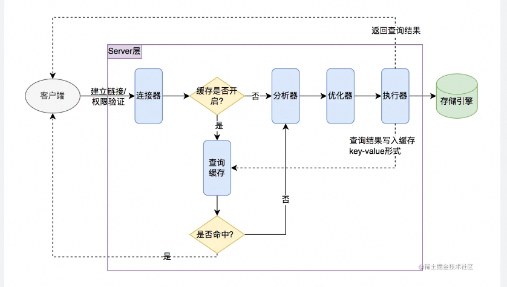

> ## x数据库设计范式（Noram Form）
>

- 1NF：表的每一元素都是不可再分的基本元素
- 2NF：表的属性完全依赖于主键
- 3NF：属性不依赖于非主键属性，消除传递依赖
- 4NF：消除表内多对多关系
- 反范式：允许库中存在一些违反范式原则的冗余数据，来提高查询效率，减少表之间的关联，空间换时间的操作

## 索引

#### 优点

- 加快数据库的检索速度
- 唯一性索引可以保证每行数据的唯一性

#### 缺点

- 创建索引和维护需要消耗时间，这种时间量随数据的增加而增加
- 索引会占用物理内存
- 对表中数据进行增删改操作时，需要维护索引

#### B树 / B+树

也称多路平衡查询树，广泛应用在数据库索引，不需要像平衡二叉树那样经常做平衡操作不能直接找到具体的行，只是找到被查找行所在的页，然后DB通过把整页读入内存，再在内存中查找。

减少IO交互的次数

M阶B树的特征：

- 所有叶子节点在同一层级
- 最多有M-1个关键字和M个孩子节点

- 根节点的儿子数在区间[2, M]之间，关键字数最少为2
- 非叶子节点的关键字数等于儿子数-1
- k个关键字把节点拆成k+1段，分别指向k+1个儿子，同时满足查找树的大小关系。

#### B+树

B树的一种变体，结构更加矮胖，数据页只存储在叶子结点上，查询性能更好，m阶B+树的特征：

- Data只保存在叶子节点中，非叶子结点只保存Key，不存储Data，这样非叶子节点可以存储更多的Key，

  所以整体结构相对B树更加矮胖，与磁盘交换的IO操作次数变少

- 所有的非叶子节点都可以看作是索引，其保存的关键字不包含任何数据指针

- 除了根之外的每个节点都包含最少 m/2 个元素最多 m-1个元素

-  叶子节点相互按顺序以链表形式连接

### 联合索引

### 最左匹配原则

在mysql建立联合索引时会遵循最左匹配原则，即最左优先，在检索数据时从联合索引的最左边开始匹配，最左边的为起点任何连续的索引都能匹配上，其他无效，OR关键词无效

### 关键字执行顺序

from、on、 join 、where 、group by、 avg,sum.... 、having 、select 、distinct 、order by、limit 

## 事务

### 四大特性

- 原子性（Atomicity）:事务包含的一系列操作要么全部成功，要么全部回滚，它们是一个不可分割的操作整体
- 一致性（Consistency）:事务对数据完整性约束的遵守，例如主键约束、唯一索引约束、外键约束，事务执行前后，不会违背任何数据的完整性
- 隔离性（Isolation）：当多个用户并发操作数据库，数据库为每个用户开启独立的事务，他们之间不互相影响，与串行执行的效果是一样的
- 持久性（Duration）：一单事务提交，事务对数据库的改变是永久的

### 隔离级别

不可重复读：某行数据多次读取数据不一致，被**修改**， 行锁即可
幻读：两次读取不一致，**新增或删除**，表锁或者间隙锁解决

- **读未提交**(READ UNCOMMIITED): 该隔离事务级别会读取到未提交事务的数据，也称之为**脏读**

- **读提交**(READ COMMITTED): 一个事务可以读取到另一个已提交的事务，多次读取会造成不一样的结果，称之为**不可重复读问题**，Oracle和Sql Server的默认级别


- **可重复读**（REPEATABLE READ): 该隔离级别是 MySQL 默认的隔离级别，在同一个事务里，`select` 的结果是事务开始时时间点的状态，因此，同样的 `select` 操作读到的结果会是一致的，但是，会有**幻读**现象

- **序列化**(SERIALIZABLE): 在该事务隔离级别下，事务都是串行顺序执行，MySQL 数据库的 InnoDB 引擎会给读操作隐式加一把读共享锁，从而避免了脏读、不可重读复读和幻读问题。

## 锁

#### 锁级别

数据库锁机制是为了保证共享资源在被并发访问时数据的一致性所设计的一种规则

- 表级锁，锁定Mysql中最大粒度（表）的锁定机制，MyISAM和InnoDB均支持，实现逻辑简单，获取锁和释放锁比较快，由于锁定粒度比较大，发生冲突的概率较大，并发度较低。由于MyISAM会一次性获取所需要的全部锁，要么全部等待，要么全部满足，所以不会发生死锁。MySQL的表级锁定主要分为两种类型，一种是读锁定，另一种是写锁定。在MySQL中，主要通过四个队列来维护这两种锁定：两个存放当前正在锁定中的读和写锁定信息，另外两个存放等待中的读写锁定信息
- 行级锁，针对当前操作的行进行锁定，仅InnoDB支持，能大大减少数据库操作的冲突，提高了并发处理的能力。由于行锁通过索引进行加锁，所以只有通过索引条件进行检索数据，InnoDB才会使用行级锁，否则为表级锁。

#### 死锁

多个进程访问同一数据库，其中每个进程拥有的锁都是其他进程所需要的，由此造成每个进程都无法进行下去；例如进程A等待进程B释放他的资源，B又等待A释放他的资源，这样就互相等待就形成死锁。

#### 类型

| 锁/类型                | 公平/非公平锁 | 可重入/不可重入锁 | 共享/独享锁          | 乐观/悲观锁 |
| ---------------------- | ------------- | ----------------- | -------------------- | ----------- |
| synchronized           | 非公平锁      | 可重入锁          | 独享锁               | 悲观锁      |
| ReentrantLock          | 都支持        | 可重入锁          | 独享锁               | 悲观锁      |
| ReentrantReadWriteLock | 都支持        | 可重入锁          | 读锁-共享，写锁-独享 | 悲观锁      |

- 共享锁（shared lock）和排他锁（exclusive lock）

共享锁，也称读锁，允许其他事务再加共享锁，但是不允许加排他锁

```
加锁方式：select ... lock in share mode
```

排他锁，不允许其他事务加共享锁或者排他锁

```
加锁方式：select ... for update
```

另外，InnoDB默认是行级锁，所以若指明主键时，使用行锁；否则使用表锁；

- 乐观锁和悲观锁

乐观锁，每次取数据的时候，默认数据不会发生改变，但是在写数据的时候回去判断数据是否被修改，适用于多读的场景。Java atomic包下多使用此实现方式 - CAS，compare and set.

CAS:

悲观锁，通过加锁的方式限制其他人对数据的操作

- 公平锁与非公平锁：

  公平锁表示线程获取锁顺序是按照线程加锁的顺序来分配的，即FIFO顺序。而非公平锁就是一种获取锁的抢占机制，是随机获得锁的。

- 可重入锁和不可重入锁：同一线程的代码可以进入其拥有锁的代码块，是则是可重入锁，否则是不可重入锁。**ReentrantLock**和**Synchronized**都是可重入锁。

  

## 分库分表

分表条件：
- 表日增量超过1G
- 整库QPS > 10k, TPS > 5k
- 单表占用空间超过200G
**垂直拆分**

- 垂直分表，将表中字段较多的，不常用的字段放到扩展表
- 垂直分库，针对系统中的不同业务进行拆分，不同业务的表放在不同的库，避免数据库的单库处理能力成为瓶颈

**水平拆分**

- 水平分表，针对数据量巨大的表，按照某种规则切分到多张表中去，但是这些表依然在同一个库里面

- 水平分库分表，针对数据量巨大的表，按照某种规则切分到多张表中去，这些表在不同的数据库里面，能有效缓解单机和单库的性能压力、IO、连接数、硬件资源等

- 切分规则：

  - 按range切分，例如1-10000一张表10001-20000一张.....

  - Hash取模，一个商场系统，一般都是将用户，订单作为主表，然后将和它们相关的作为附表，这样不会造成跨库事务之类的问题。 取用户id，然后hash取模，分配到不同的数据库上。

  - 地理区域

    比如按照华东，华南，华北这样来区分业务

  - 时间

    按照时间切分，就是将6个月前，甚至一年前的数据切出去放到另外的一张表，因为随着时间流逝，这些表的数据 被查询的概率变小，所以没必要和“热数据”放在一起，这个也是“冷热数据分离”。

  **事务管理**

  - 数据库自带的分布式事务管理
  - 代码层面进行控制

分库：突破单机物理瓶颈时，比如带宽或者磁盘
8C16G, 支持1亿条数据， 单表不超过200G，
  

### MVCC
Multi-Version concurrency control， 多版本并发控制，使用快照读的方式来提高`读-写 `场景下的性能。

优点：

- 读、写操作不会相互阻塞
- 解决脏读、幻读、不可重复读等数据隔离问题

通过undo.log 实现，记录了各版本的数据信息，当某个事务出错时，回滚数据状态


### DB引擎

#### 应用场景

- InnoDB是事务型数据库的首选引擎，支持行级锁定，支持ACID事务，如果应用中需要执行大量的插入和更新操作，则应该使用InnoDB
- MyISAM管理非事务表，它提供高速存储和检索，以及全文检索能力，如果应用中有大量的查询语句，应该选择MyISAM。

#### 主要区别

- MyISAM不是事务安全的，InnoDB是事务安全的
- MyISAM锁的粒度是表级，InnoDB是SQL行级
- MyISAM支持全文类型索引，InnoDB不支持


## Log

### bin log
主从同步、数据备份

MySQL Server层的log文件，记录commit后的DDL、DML语句，不会记录SELECT、SHOW语句，因为只读的SQL不会对数据库产生变更。由于bin log记录了每个变更的内容，理论上可以将数据库的内容恢复到bin log存在的任意时刻，可以用于数据备份、崩溃恢复、主从复制。也可以用于数据库操作审计，分析其中的操作行为，可以实现轻量级的数据库操作审计，追踪其中的误操作发生的时间或者识别危险SQL的发生。

#### BinLog记录模式

```show variables like 'binlog_format';```

开启BinLog会带来约1%的性能损耗

| Format    | 定义                     | 优点                         | 缺点                           |
| :-------- | ------------------------ | ---------------------------- | ------------------------------ |
| Statement | 记录修改的SQL语句        | 日志文件小，节约IO，提升性能 | 准确性差                       |
| Row       | 记录每行实际的数据变更   | 准确性强，能准确复制变更     | 日志文件大，较大的网络和磁盘IO |
| Mixed     | statement和row的混合模式 | 准确性强，文件大小适中       | 有可能会有主从不一致的问题     |

**基于行复制模式（row模式）**

row模式下，不记录执行的sql语句上下文信息，记录下每一行数据修改的细节，以及DDL语句。比如一条update更新多行记录时，每一条记录的变动都会保存到DB中，日志量比较大 

**基于SQL语句的模式(statement模式）**

statement模式下，每一条会修改数据的sql都会记录到 master的bin-log中。slave在复制的时候sql进程会解析成和原来master端执行过的相同的sql来再次执行。statement 模式下的优点首先就是不需要记录每一行数据的变化，减少bin-log日志量，节约IO，提高性能

**混合模式（mixed模式）**

mixed其实就是前两种模式的结合。在Mixed模式下，MySQL会根据执行的每一条具体的sql语句来区分对待记录的日志形式，也就是在Statement和Row之间选择一种。目的是最大限度地记录数据库中每一行数据的变化，也能够减少binlog的日志量，节约空间。


### redo log

执行引擎层（InnoDB或者MyIsam）的log文件，记录事务发起后的dml和ddl语句， 保障crash-safe（灾备），物理日志，记录哪个表空间，哪个数据页，修改了什么，比如 `update T set c=c+1 where ID=2;`这条SQL，redo log 中记录的是 ：`xx页号，xx偏移量的数据修改为xxx；`binlog 中记录的是：`id = 2 这一行的 c 字段 +1`

### undo log

执行引擎层（InnoDB或者MyIsam）的log文件，作用是回滚，记录各版本的数据信息， 提供事务隔离性、原子性。


MySql用两阶段XA提交保证redolog和binglog的一致性，用undolog保证事务的原子性，写入redo log分为两个步骤，prepare和commit，

一条数据库的更新指令到达后会执行以下操作：

- 记录undolog

作用是回滚，保证原子性：把修改之前的数据作为历史保存一份到undolog里面的，数据里面会记录操作该数据的事务ID，在事务需要进行回滚的时候，通过对比undolog日志把已经修改的数据进行还原。

- 将新数据写入内存，同时记录redolog并将redolog写入内存

- 将内存中的redolog写入到磁盘中，其状态设为prepare，通知binglog

引擎将这行新数据更新到内存中，同时将这个更新操作记录到 redolog 里面，此时 redo log 处于 prepare 状态。然后告知执行器执行完成了，随时可以提交事务。

作用是宕机后恢复：redo log的功能就是事务提交之前首先会把本次事务需要变更的数据，包括修改磁盘那块扇区、修改哪些数据等，通通都记录下来。所以只要保证成功记录了redo log ，那么就算事务提交之后（即redolog日志状态为commit）发生了崩溃、宕机，此时内存的数据即便没有即时写入磁盘，又或则只写入了一部分数据到磁盘，我们只需要通过找到事务对应的redo log，再对数据进行对比恢复即可。

- 写入binglog到磁盘中，并通知redolog

执行器生成这个操作的 binlog，并把 binlog 写入磁盘。

- redolog状态设为commit

执行器调用引擎的提交事务接口，引擎把刚刚写入的 redo log 改成提交（commit）状态，更新完成。

commit后的日志，在宕机后能帮助数据库恢复数据


### 主从同步

基于从库对主库的BinLog订阅来实现，使用到三个线程，master（binlog dump thread）、slave（I/O thread 、SQL thread）。

**master**
1）binlog dump: 当主库中有数据更新时，按照设置的格式（row/statement/mixed）写入到binlog文件，主库创建log dump线程通知从库有数据更新，当Slave IO线程请求日志内容时，将binlog文件名称与位置告知。

**slave**

1）I/O thread: 连接到master，向log dump线程请求一份制定binlog文件位置的副本，并将请求回来的binlog写入到本地的relay log, relay log 与bin log相似，使用二进制写入，保存数据更新的事件，名称按照后缀递增名的方式。Salve使用index文件追踪当前使用的relay log文件

2）SQL thread: 检测到relay log有更新后，会读取并在本地做redo操作，将发生在主库的事件在本地重新执行一遍，来保证主从数据同步。此外，如果一个relay log文件中的全部事件都执行完毕，那么SQL线程会自动将该relay log 文件删除掉。

强制主库：
1、 /*master*/
2、指定主库
3、事务SQL都走主库

主从同步延迟：
1、
sync_binlog: 
事务提交之后，将binlog从缓冲区写入磁盘， 0 - 不进行操作，等待缓冲区的自动处理， 1 - 事务提交之后，立即同步磁盘，最安全 N - 执行N次事务之后，同步磁盘可提升slave性能

innodb_flush_log_at_trx_commit:
控制redo log buffer， redo log：crash recovery
0: InnoDB会每秒钟将log buffer中的数据更新到磁盘中fsync
1: 每次事务提交时将log buffer的数据更新到磁盘，fsync
2: 每次事务提交只写入到page cache.

buffer里的数据写到磁盘：
1、write： 把buffer中数据写入到文件系统的page cache，操作较快，但容易断电丢失
2、fsync：真正将数据同步同步到磁盘，不会丢失


## 慢SQL

### SQL执行过程


建立连接 -> 权限验证 -> SQL解析 -> SQL优化 -> SQL执行
```
show variable 'long_query_time' # 慢查询时间
show variable 'slow_query_log' # 是否开启慢查询日志

```

不走索引的情况
1、not in
2、 ！= 
3、类型不匹配
4、in 超过一定比例（30%）

explain关键字
https://cloud.tencent.com/developer/article/2153636


update:
使用唯一索引，只会给改行记录加next-key锁
没有索引，则会扫描全表，给全表上锁