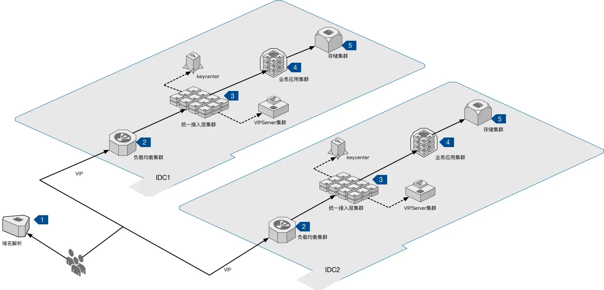
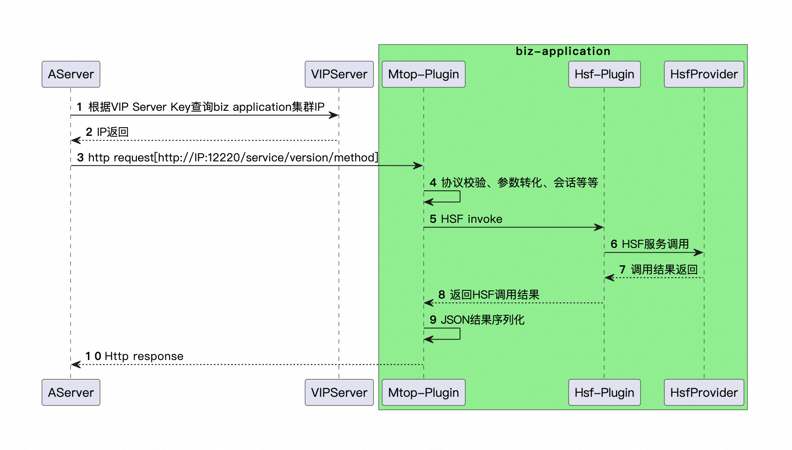
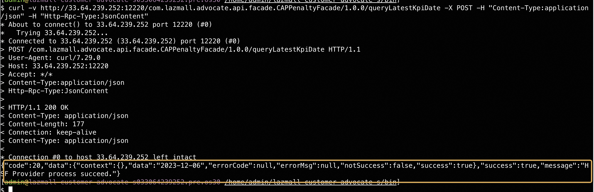
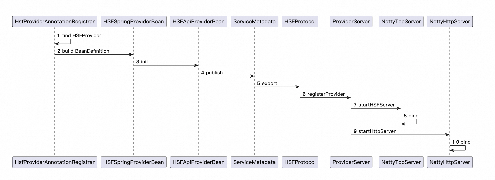

## 1. 背景
在不稳定的网络环境中，如何保证一个请求能被接收方正确处理。一个网络请求会经过多层的架构，应用层、传输层、网络层、数据链路层，虽然各层专注点不同，但是都有关于可靠性的保障措施，来确保数据请求准确无误传输，包括应用层 Http、Ftp、RPC请求方式，传输层TCP，网络层IP, 数据链路层MAC，做一次全链路的调研，探索一次网络请求，是如何来保障正确、可靠的。
研究一次Mtop请求过程，发生了"FAIL_SYS_SERVICE_TIMEOUT::请求服务超时"的情况下，如何通过重试/传机制来保障请求的稳定性。
### 1.1 集团网络架构

上图囊括了一次用户请求涉及到的主要节点
**1. 域名解析(ADNS)***
   集团自研的权威DNS，提供域名解析、机房灾备、流量切换能力。
   流程步骤
   ● 域名解析得到Cname
   ● 根据Cname映射到gds域名，即a.taobao.com CNAME 至a.taobao.com.gds.alibabadns.com，
   ● 再为a.taobao.com.gds.alibabadns.com分配对应的A解析IP地址
   容灾切换
只要gds域名对应的解析结果VIP挂了（ADNS健康监测提示VIP不通），ADNS将自动迁移走解析结果至其他VIP，实现自动容灾切换。或者在灾备平台预定义切换预案，手动执行触发切换。

**2.负载均衡集群(LVS, Linux Virtual Server)**
   运行在Linux内核的虚拟集群，提供四层（传输层）负载均衡服务，根据请求目标IP/端口实现请求的转发，转发模式包括网络地址转换（NAT，Network Address Translation）、IP隧道（TUN，IP Tunneling）和直接路由（DR，Direct Routing），FULLNAT转发模式。  

**3.统一接入层集群(AServer)**
   全网https项目，需要将所有前端应用的请求协议由http转换成https，由于https涉及到ssl证书，ssl证书以.key和.crt的文件的方式存放在tengine的配置里。而ssl证书每隔若干年就要更新一次，如果采取以前应用流量分流到每个应该单独的vip的方式，将带来海量证书过期的不可维护性。因此集团决定统一https入口。（官方解释）
      
   |    | 原理  | 优点 | 不足 | 适用场景 | 
   |  ----  | ----  |----| ----  | ----|
   | DR模式 | 将请求报文的目标MAC地址设定为挑选出的RS MAC地址 | DR的性能是所有模式中最高的，它只需要修改目的MAC；响应报文通过RS直接返回 | ● 部署上必须要求LVS和后端服务器在同一个VLAN中。                                                  | DR非常适合小规模网络，几十台服务器的规模，特别适合DR这种高效的模式； |
   | NAT模式 | 修改目标IP地址为挑选出的RS的IP地址。 | 实现简单； | ● 请求和响应报文都需要经过Director Server，高负载场景中，Director Server易成为性能瓶颈； ● DIP和RIP必须在同一个网段内 | 小规模使用|
   | FULLNAT模式 | 修改目标IP地址为挑选出的RS的IP地址。修改源IP地址为DIP | 解决跨VLAN问题；集群横向扩展；|  ● RealServer无法获得用户IP | 集群横向扩展；大规模组网部署 |
   | TUN模式 | 在原有的IP报文外再次封装多一层IP首部，内部IP首部（源地址为CIP，目标IIP为VIP），外层IP首部（源地址为DIP，目标IP为RIP） | 只负责将请求包分发给后端节点服务器，而RS将应答包直接发给用户。 | ● 配置复杂；● 每个数据包都需要增加一个IP头部，如果收到的数据包是已经达到以太网帧最大长度1.5K，IP 头无法添加。 | 异地容灾 |

**4.业务应用集群**
   后端业务应用部署集群，例如Lazmall-Channel、Lazmall-customized-service所部署的应用集群，启动时，潘多拉集成的Mtop-uncenter插件启动Mtop接口服务.
   Mtop-uncenter插件: 协议解析、防爬/刷、鉴权、会话管理、服务调用  

## 2. Mtop
   Mtop（Mobile Taobao Open Platform）为客户端和服务端提供了一致的API平台，集成了大量的业务接口，支持App、H5等接入，提供如下功能：  
   ● 基于HTTP，定义了一套标准的API数据协议，规范了请求的问答  
   ● 通过Mtop管理平台，支持API的快速创建、测试和发布  
   ● 丰富的API报表 & 实时监控服务保障  
   起初，Mtop网关独立部署，所有外部流量统一经过网管，进行中心化的部署和运维。随着业务增长，中心化网关集群的管理和稳定性逐渐复杂。进行去中心化，取消了mtop集群独立部署，将mtop集群的功能一部分转移到Aserver端，一部分转移到应用服务的潘多拉插件中，随应用启动提供鉴权、限流、统一协议等网关功能。

AServer调用Biz Application Mtop接口

```
curl -v http://33.64.239.252:12220/com.lazmall.advocate.api.facade.CAPPenaltyFacade/1.0.0/queryLatestKpiDate -X POST -H "Content-Type:application/json" -H "Http-Rpc-Type:JsonContent"
```


HSF发布/订阅, 参考HsfProvider发布   
● 向Spring容器注册Bean  
● 启动Netty事件监听，包括HSF和Http  
● 向注册中心进行服务提供者注册  



## 3. 重试/传
### 2.1 RPC超时与重试
为什么需要超时与重试？
增加系统的可靠性，在系统层面快速失败，在超过请求返回最大时间后，主动失败，释放资源，避免大量请求失败带来的雪崩效应。
简单重试提升接口的成功率，由于网络抖动或者GC等原因，可能导致服务的短暂不可用，在间隔一定时间后简单重试，补救服务成功率.

由于重试具有放大效应，例如A -> B -> C, A对B的一次调用，B会调用3次C，那么A请求B失败的重试N次，则会对C带来3*N次调用，如果B重试N次，那么将是3*N*N次对C的调用，重试的请求会放大到下游。可使用RetryCode或者特殊错误码，来避免失败请求重试的放大效应.

### 2.2 TCP重传
RTT(Round-Trip Time): 往返时延，数据从发送到确认接受的时间
RTO(Retransmission Timeout): 超时重传时间。

**重传策略**  
● 超时重传：数据包在发送之后，启动一个定时器，如果在指定的时间内没有收到ACK则重发数据包  
● 快速重传：TCP的报文到达确认（ACK），以接收到的最高序列号进行确认，例如主机A发送了序号100到200的数据报，则接收端收到会返回确认号201到主机A。  
● 选择重传  
● Sync重传  

附录
ASever https://code.alibaba-inc.com/ali-devops/devops/wikis/aserver
https://ata.atatech.org/articles/11000215775?spm=ata.23639746.0.0.6a343565KESwJM
http://mw.alibaba-inc.com/products/hsf/_book/hsf-http.html?spm=ata.21736010.0.0.7dcf7536MUI4JX