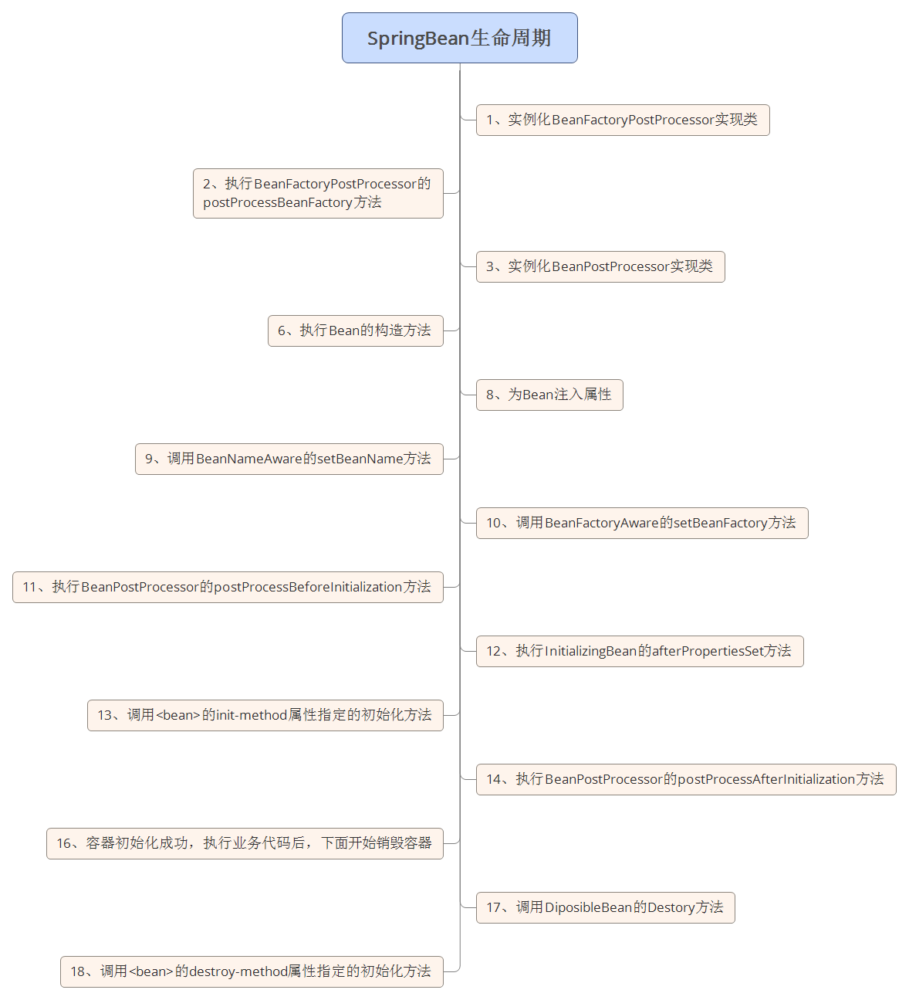

# Spring

轻量级的Java开发框架，解决企业级应用开发业务逻辑层与各层之间的耦合问题，根本是降低应用开发的复杂性，

## 两个核心特征

- 控制反转（Inverse of Control， IOC，由Spring容器来管理对象的生命周期和依赖关系，依赖关系通过依赖注入（dependency injection,DI)来实现，**动态的向某个对象提供它所需要的其他对象**
- 面向切面编程（aspect-oriented programming, AOP），横向对软件进行编程，自定以拦截器和切点，封装业务模块共同调用的代码，例如事务处理、日志管理、权限控制等，减少系统的重复代码

## 模块

- spring core：提供了框架的基本组成部分，包括控制反转（Inversion of Control，IOC）和依赖注入（Dependency Injection，DI）功能。
- spring beans：提供了BeanFactory，是工厂模式的一个经典实现，Spring将管理对象称为Bean。
- spring context：构建于 core 封装包基础上的 context 封装包，提供了一种框架式的对象访问方法。
- spring jdbc：提供了一个JDBC的抽象层，消除了烦琐的JDBC编码和数据库厂商特有的错误代码解析， 用于简化JDBC。
- spring aop：提供了面向切面的编程实现，让你可以自定义拦截器、切点等。
- spring Web：提供了针对 Web 开发的集成特性，例如文件上传，利用 servlet listeners 进行 ioc 容器初始化和针对 Web 的 ApplicationContext。
- spring test：主要为测试提供支持的，支持使用JUnit或TestNG对Spring组件进行单元测试和集成测试。

## 作用域

Spring框架支持以下五种bean的作用域：

- singleton : bean在每个Spring ioc 容器中只有一个实例。
- prototype：一个bean的定义可以有多个实例。
- request：每次http请求都会创建一个bean，该作用域仅在基于web的Spring ApplicationContext情形下有效。
- session：在一个HTTP Session中，一个bean定义对应一个实例。该作用域仅在基于web的Spring ApplicationContext情形下有效。
- global-session：在一个全局的HTTP Session中，一个bean定义对应一个实例。该作用域仅在基于web的Spring ApplicationContext情形下有效。

## Bean生命周期

- 实例化
- 属性赋值
- 初始化
- 销毁

## DispatcherServlet

前端控制器，处理所有从用户过来的请求，将请求分发给合适的Controller，Controller内部完成请求的数据模型的创建和业务逻辑的处理，然后将填充了数据后的模型即model和控制权一并交予DispatcherServlet来渲染响应。DispatcherServlet再将这些数据和适当的数据模版视图结合，向Response输出响应

### Filter(过滤器)

## Interceptor(拦截器)

